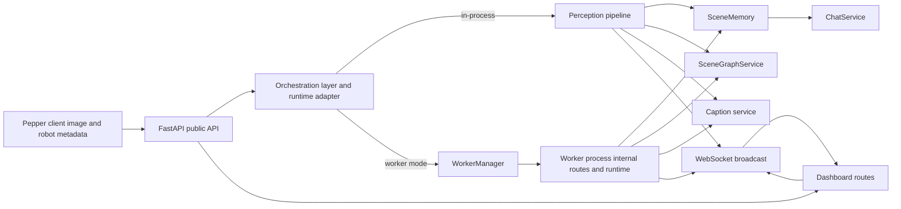
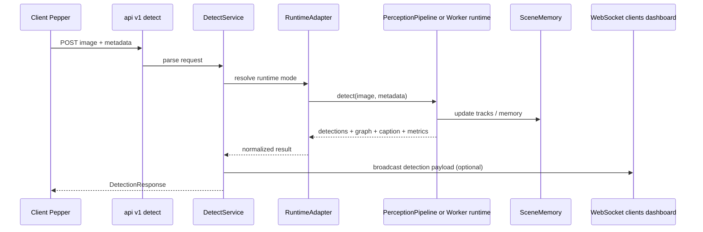
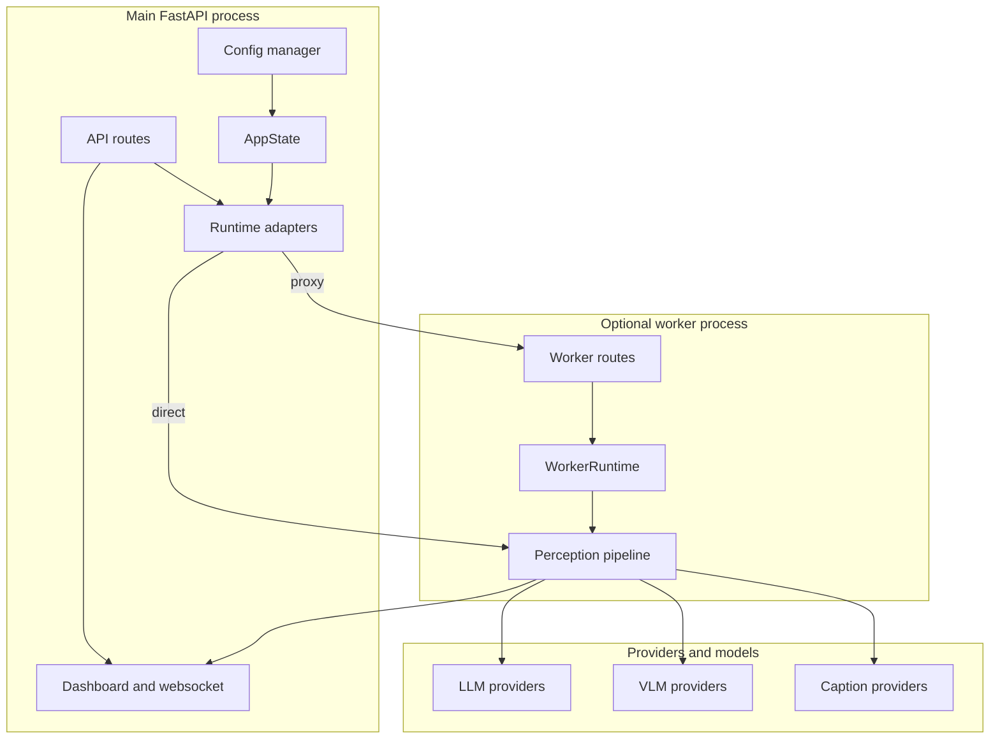

# Architecture Overview

## Purpose

The server is the perception, memory, scene-graph, dialogue, and operator-control side of the Pepper system. It accepts camera images and robot metadata, runs configurable perception and grounding stages, stores dynamic scene state, serves dialogue and caption requests, optionally delegates heavy work to a separate worker process, and exposes a dashboard for runtime inspection and control.

## High-Level Components

### 1. Public HTTP/API layer

Files:
- `app/main.py`
- `app/api/v1/*.py`
- `app/dashboard.py`

Responsibilities:
- Starts FastAPI.
- Mounts static files.
- Exposes public routes under `/api/v1`.
- Exposes dashboard routes and websocket broadcast channel.

### 2. Runtime state and dependency assembly

Files:
- `app/core/runtime/state.py`
- `app/core/pipeline_factory.py`
- `app/core/config/*`
- `app/core/infra/*`

Responsibilities:
- Owns the active config.
- Builds pipeline, services, memory, providers, and worker manager.
- Applies config changes.
- Stores latest published state for dashboard replay.

### 3. Orchestration layer

Files:
- `app/orchestration/services/*`
- `app/orchestration/adapters/runtime.py`

Responsibilities:
- Translates API inputs into runtime actions.
- Chooses in-process vs worker-backed execution.
- Maintains conversation state.
- Broadcasts state changes to dashboard clients.

### 4. Inference layer

Files:
- `app/inference/*`

Responsibilities:
- Detection
- Captioning
- Tracking and ReID
- Dynamic scene memory
- Scene graph generation
- Set-of-Mark overlay creation
- Per-frame metrics and stage execution accounting

### 5. Provider/client layer

Files:
- `app/providers/*`

Responsibilities:
- Normalize access to OpenAI, Gemini, local HF, and related model runtimes.
- Handle structured output parsing.
- Handle translation.
- Resolve provider-specific init and call kwargs.

### 6. Worker runtime

Files:
- `app/core/runtime/worker_client/*`
- `app/worker/*`

Responsibilities:
- Spawn and monitor a separate inference process.
- Proxy requests from the main FastAPI app to the worker.
- Allow hot config push and hard rebuild behavior.
- Support idle shutdown and restart logic.

### 7. Operator UI

Files:
- `app/static/templates/*`
- `app/static/js/dashboard/*`
- `app/dashboard.py`

Responsibilities:
- Inspect latest frame and memory.
- Edit config.
- Inspect scene graph.
- Send chat messages.
- Control worker lifecycle.

## Main End-to-End Flows

## A. Detection flow

1. Client POSTs image and metadata to `/api/v1/detect`.
2. `DetectService` parses image + robot metadata.
3. Runtime adapter chooses in-process or worker execution.
4. `PerceptionPipeline.process()` runs enabled stages.
5. Result is normalized into API payload form.
6. If `publish=true`, websocket broadcast occurs and latest state may be persisted.

## B. General chat flow

1. Client POSTs to `/api/v1/chat`.
2. Conversation is created or resumed.
3. Input text may be translated to the configured output/model language.
4. `ChatService` composes prompt from scene memory, captions, and conversation history.
5. LLM provider generates answer.
6. Output may be translated back.
7. Conversation state is stored and broadcast.

## C. Object chat flow

1. Request uses `mode=object` and includes `object_label`.
2. `ChatService.object_chat()` resolves matching tracked objects from scene memory.
3. If structured facts are weak, crop-based caption fallback may be used.
4. Object-focused context is added to the prompt.
5. Response returns matched object IDs in metadata.

## D. Vision chat flow

1. Client POSTs image + query to `/api/v1/vision_chat`.
2. Conversation history is optionally prepended.
3. Runtime adapter routes the image directly to the VLM path.
4. VLM answers directly from image input, bypassing scene-memory-driven grounding.

## System Boundary Diagram

## E. Config flow

1. Dashboard or API client calls `/api/v1/config` or `/api/v1/config` PATCH.
2. Patch is validated against `AppConfig`.
3. Diff is computed by reload rules.
4. Hot changes are applied in place where supported.
5. Hard changes rebuild pipeline and/or worker runtime.

## Process Boundaries

### In-process mode

- All inference objects live inside the main FastAPI process.
- Lowest operational complexity.
- Highest memory pressure in the main server.
- Used when `worker.enabled = false` or no worker manager is available.

### Worker mode

- Main API process stays comparatively thin.
- Heavy inference runs inside worker process.
- Main process proxies detection, vision chat, and memory mutations via HTTP/RPC-like calls.
- Better isolation for GPU-heavy stages.

## State Ownership

- Global app lifecycle state: `AppState`
- Latest dashboard replay payload: `AppState.last_state`
- Dynamic world model: `SceneMemory` -> `SceneMemoryStore`
- Conversation history: `ConversationService`
- Persisted config: `server/config.yaml`
- Optional persisted latest state: `server/state/last_state.json` and sibling `.jpg`

## Important Couplings

- `ChatService` depends on `SceneMemory` structure and recent captions.
- `PerceptionPipeline` depends on pipeline controls from config.
- `SceneGraphService` depends on detection IDs being stable enough for relation grounding.
- `WorkerRuntime` and main process share the same config schema.
- Dashboard config UI is tightly coupled to field names in `AppConfig` and `/api/v1/config` payload shape.

## Safe Tweak Zones

- Prompt text and ontology files under `server/prompts` and `server/ontology`
- Detection thresholds and provider configs in `config.yaml`
- Rule-based SGG rules in `scene_graph.rules.rule_list`
- Pipeline stage toggles in `pipeline_controls`
- Worker lifecycle timing in `worker.*`

## High-Risk Tweak Zones

- Changing `SceneState`, `TrackedObjectState`, or related schemas
- Changing object ID semantics in tracking/memory
- Changing config field names without updating dashboard JS and reload rules
- Changing worker request/response contracts without updating both main and worker sides
