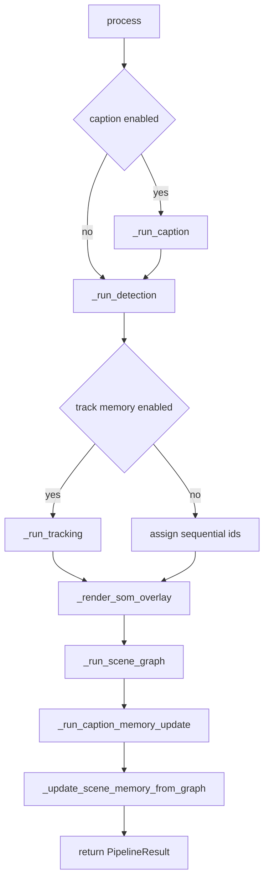

# Inference Pipeline

## Files Covered

- `app/inference/pipeline.py`
- `app/inference/types.py`
- `app/core/pipeline_factory.py`

## Central Entry Point

The core runtime entry is `PerceptionPipeline.process(image, robot_metadata)`.

This is the single source of truth for per-frame processing order.

## Pipeline Constructor Dependencies

`PerceptionPipeline` is assembled with:
- detector
- memory
- SoM painter
- scene graph service
- optional caption service
- fusion config
- visualization config
- pipeline controls

This means the pipeline object is not just a detector wrapper. It is the coordinator for nearly every perception-side subsystem.

## Stage Order

The current order is:

1. caption
2. detection
3. tracking + memory update
4. SoM rendering
5. scene graph generation
6. caption memory update
7. scene graph memory update
8. metric aggregation

This order matters.

### Why caption runs first

Caption can be used as auxiliary context for scene graph generation.

### Why tracking runs before scene graph

Stable `object_id` assignment is needed before structured relations are useful.

### Why memory update happens before scene graph-memory update

The graph should enrich an already stabilized object memory, not create identity semantics on its own.

## Execution Controls

Controlled by `PipelineControls`.

Flags:
- `caption`
- `detect`
- `track_memory`
- `paint_som`
- `scene_graph`
- `update_scene_memory`

Preset names:
- `full`
- `detect_only`
- `caption_only`
- `vlm_only`
- `rules_only`
- `minimal`
- `custom`

### Important stage dependencies

Some stages are logically dependent on others even if toggles exist separately. Validation enforces several of those constraints at config level.

## Metrics

Each timed stage writes to the `metrics` dictionary using `stage_timer()`.

Examples:
- `caption_time`
- `detection_time`
- `memory_update_time`
- `som_image_paint_time`
- `scene_graph_generation_time`
- `caption_memory_update_time`
- `scene_graph_memory_update_time`
- `total_processing`

These metrics are surfaced to dashboard/live consumers and are useful when deciding whether a change belongs in hot path or offline research code.

## Return Type

`PipelineResult` carries:
- raw image
- SoM image
- tracked detections
- scene graph
- caption text
- caption provider/model metadata
- stage metrics
- executed stage list

## Failure Policy

### Caption stage

Caption failures are tolerated. The pipeline logs a warning and continues.

### Detection stage

Detection is central. If disabled, later detection-dependent stages either no-op or receive empty detections.

### SoM stage

If SoM is disabled or unavailable, raw image fallback is used for downstream VLM path.

## Internal Helper Stages

### `_run_caption()`
- runs only if caption control is enabled and caption service exists

### `_run_detection()`
- calls detector and appends `detect` stage

### `_run_tracking()`
- if memory tracking disabled, assigns sequential IDs locally
- otherwise calls `SceneMemory.update()`

### `_render_som_overlay()`
- requires both `paint_som` and `detect`
- uses visualization config flags for bbox/mask/polygon/labels

### `_run_scene_graph()`
- sends detections plus SoM/raw image and optional caption to `SceneGraphService`

### `_run_caption_memory_update()`
- inserts caption into scene memory as `SceneCaptionState`
- uses UUID frame-level caption IDs

### `_update_scene_memory_from_graph()`
- merges graph relations/attributes into memory when enabled

## Where to Change Behavior

Change pipeline order when:
- you are changing fundamental semantics of grounding

Change stage internals when:
- you are improving one subsystem only

Change `PipelineControls` when:
- you need a new preset or runtime execution mode

## Common Pitfalls

- expecting object IDs to be persistent when `track_memory = false`
- forgetting SoM requires detection output
- forgetting scene-memory update requires scene graph and tracking
- assuming caption exists in all runs
