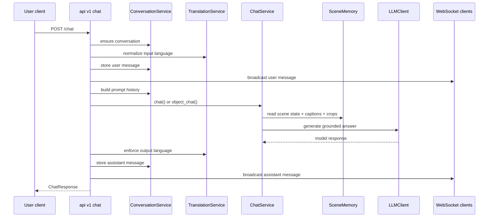
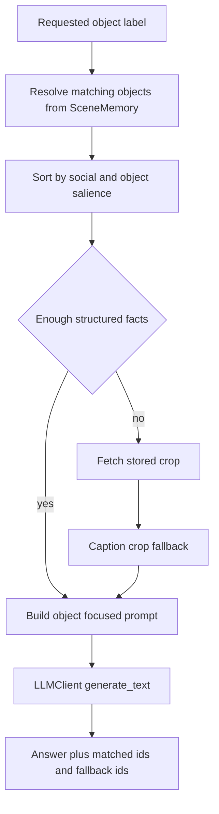

# Orchestration and Conversations

## Files Covered

- `app/orchestration/services/detection.py`
- `app/orchestration/services/chat.py`
- `app/orchestration/services/caption.py`
- `app/orchestration/services/conversation.py`
- `app/orchestration/services/memory.py`
- `app/orchestration/adapters/runtime.py`

## Role of the Orchestration Layer

The orchestration layer sits between HTTP routes and low-level inference/provider code.

Its job is to:
- normalize external inputs
- manage conversation state
- choose in-process vs worker execution path
- format runtime payloads for websocket/dashboard use
- expose memory-editing operations through a stable service surface

## `DetectService`

Main responsibilities:
- parse uploaded image bytes into PIL image
- parse Pepper metadata JSON into `RobotMetadata`
- normalize camera FOV units if degrees are accidentally supplied
- call `resolve_runtime_adapter(state)`
- turn runtime result into `DetectionResponse`
- publish websocket messages when requested
- persist latest state/image when configured

### Metadata parsing details

`parse_metadata()`:
- returns minimal metadata if none provided
- parses `people` into `PersonMetadata`
- parses `social_people` into `SocialPersonMetadata`
- normalizes `camera_hfov` and `camera_vfov`

### Persistence side effects

When publishing and storage persistence are enabled:
- latest payload is stored in `AppState.last_state`
- JSON state may be written to configured path
- image may be stored separately as JPG when `storage.store_image = true`

## `ChatService`

This is the main grounded text-generation coordinator.

### Constructor inputs

- `ChatConfig`
- `SceneMemory`
- resolved system prompt text
- optional object-specific user prompt template

### Internal capabilities

- fetch current `SceneState`
- fetch recent captions
- fetch latest caption
- fetch track crops for object fallback captioning
- compute object salience ordering
- build scene-context string
- render prompt templates via `PromptRenderContext`

### `compose_prompt(base)`

Builds prompt text by injecting:
- structured object/relation context
- latest caption
- recent captions

### `chat()`

Use case:
- general grounded conversation

Behavior:
- composes system prompt and user query with scene context
- prepends conversation history if present
- calls `LLMClient.generate_text()`

### `object_chat()`

Use case:
- answer about a specific object label

Behavior:
- resolves object label against current scene memory
- prefers exact label match, then looser containment match
- sorts candidates by salience
- optionally limits instances
- for low-fact objects, can caption stored crops as fallback evidence
- builds object-focused prompt context
- returns:
  - answer text
  - source object IDs
  - crop fallback used IDs
  - resolved object label

### Salience logic

Socially salient entities are preferred when choosing which objects matter most.

The scoring system boosts, among other things:
- people/humans/animals/robots by label class
- waving
- looking at robot
- sitting
- higher engagement zone salience
- closer robot distance

This is one of the key tweak points for making dialogue feel more socially aware.

## General Chat Request Flow

## Object Chat Focus Path

## `CaptionService`

Purpose:
- lightweight caption orchestration wrapper over caption provider client

Responsibilities:
- handle runtime prompt resolution
- expose captioning behavior to pipeline and chat crop fallback
- update runtime without always rebuilding client

## `ConversationService`

Purpose:
- maintain chat sessions and message history

Responsibilities typically include:
- ensure conversation exists
- add message
- list conversations
- get conversation by id
- reset/delete conversation
- return prompt history in model-facing `(role, text)` format
- serialize messages and conversations for UI/API

The API layer depends on this service for both `/chat` and `/vision_chat`.

## `MemoryService`

Purpose:
- higher-level validation and mutation wrapper over runtime memory adapter

Operations:
- get full memory
- list objects with filters
- list relations with filters
- merge external scene state
- reset memory
- create/update/delete objects
- create/update/delete relations
- broadcast current state after successful mutation

This is the correct service layer if you want to add audit logging, stricter validation, or authorization around memory editing.

## Runtime Adapter Interface

### In-process adapter

Calls directly into:
- `PerceptionPipeline`
- `SceneMemory`
- VLM backend for direct vision chat

### Worker adapter

Calls over HTTP to internal worker routes for:
- detect
- vision chat
- memory operations

### Why this abstraction matters

Route handlers and services should not care where heavy inference runs. If you add a new runtime mode, extend the adapter interface rather than branching route logic everywhere.

## Best Tweak Points

- change context composition: `ChatService._build_context_string()`
- change salience selection: `ChatService._object_salience_key()`
- change crop fallback policy: `ChatService.object_chat()`
- change detection publish behavior: `DetectService.process()` and `_update_and_persist()`
- change memory validation/edit semantics: `MemoryService`
