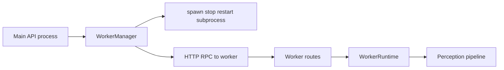
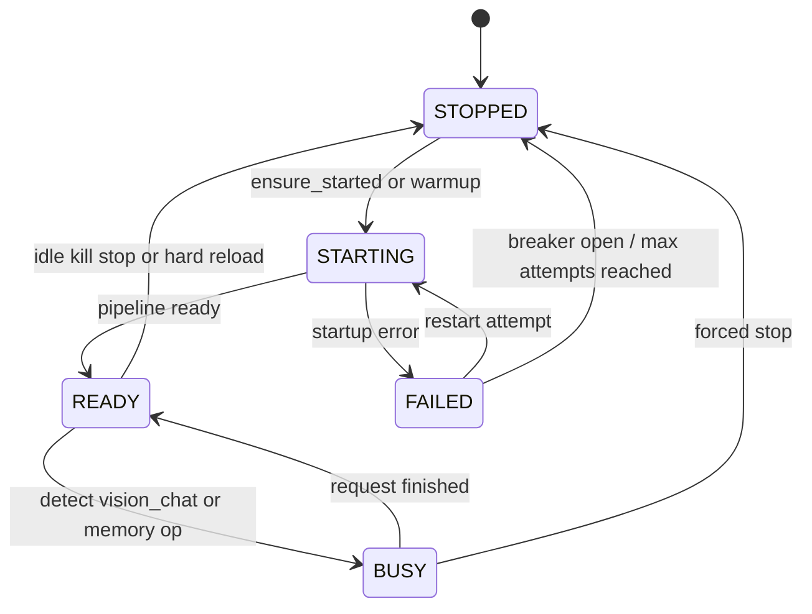
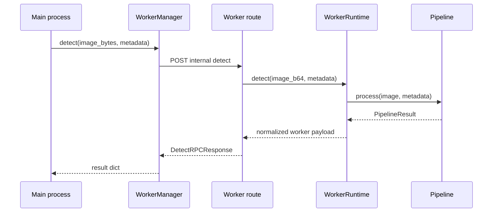

# Worker Runtime and Process Management

## Files Covered

- `app/core/runtime/worker_client/manager.py`
- `app/core/runtime/worker_client/manager_process.py`
- `app/core/runtime/worker_client/manager_rpc.py`
- `app/core/runtime/worker_client/manager_monitor.py`
- `app/core/runtime/worker_client/rpc.py`
- `app/core/runtime/worker_client/types.py`
- `app/core/runtime/worker_client/errors.py`
- `app/worker/main.py`
- `app/worker/routes.py`
- `app/worker/runtime.py`
- `app/api/v1/worker.py`

## Why Worker Mode Exists

Worker mode isolates heavy inference from the main FastAPI process.

Benefits:
- lower memory pressure in API process
- clearer process isolation for GPU-bound work
- ability to idle-kill and restart worker
- safer runtime rebuilds

Trade-offs:
- more moving parts
- network/RPC overhead even on localhost
- more contracts to keep in sync

## Main-Side Worker Manager

`WorkerManager` mixes in:
- `WorkerMonitorMixin`
- `WorkerProcessMixin`
- `WorkerRPCMixin`

### State tracked by manager

- worker state enum
- subprocess handle
- startup event / lifecycle lock
- inflight request count
- last active timestamp
- start time
- restart timestamps and counters
- idle kill count
- crash count
- circuit breaker open-until timestamp
- last error string
- config version

### Core methods

- `update_config()`
- `apply_hot_config()`
- `hard_reload()`
- `warmup()`
- `detect()`
- `get_worker_status()`

## Worker lifecycle concepts

### Enabled flag

Worker mode is only used when config says enabled and manager exists.

### Warmup

`warmup()` ensures process startup and triggers worker-side preload path.

### Hot config push

`apply_hot_config()` pushes config to worker without full restart where possible.

### Hard reload

`hard_reload()` updates config version and stops the worker so it can restart cleanly.

### Idle kill

Monitor logic can shut down the worker after configured inactivity.

### Circuit breaker

Repeated failures can open a cooldown window before restart attempts continue.

## Worker State Transitions

## RPC and payload contracts

`rpc.py` defines structured request/response payloads such as:
- `WorkerRPCRequest`
- `WorkerRPCResponse`
- `DetectRPCRequest`
- `DetectRPCResponse`
- `WorkerConfigRPCRequest`
- `WorkerStatusResponse`

If you change worker response shape, update both sides.

## Worker status enums

Defined in `types.py`:
- `WorkerState`
- `RestartReason`
- `StopReason`
- `WorkerStatusSnapshot`

These are used both operationally and for dashboard display.

## Worker runtime

`WorkerRuntime` is the worker-local service container.

## Main <-> Worker Detect Exchange

### Owned state

- active config
- perception pipeline
- caption client and prompts
- worker state enum
- inflight count
- activity timestamps
- config version
- last error

### Main capabilities

- `apply_config()`
- `ensure_pipeline()`
- `warmup()`
- `ensure_caption_client()`
- `update_caption_runtime()`
- `detect()`
- `caption()`
- `vision_chat()`
- scene memory CRUD methods
- `get_track_crop()`
- `status()`

### Important nuance

`vision_chat()` on the worker currently uses the scene-graph VLM backend client, but falls back to chat system prompt text if custom system prompt is not supplied.

## Worker app and routes

### `app/worker/main.py`
- starts worker FastAPI app
- owns worker lifespan

### `app/worker/routes.py`
- builds internal-only router used by manager adapter
- exposes detect, warmup, status, config update, memory operations, and vision chat

## Public worker routes

Exposed by main API process via `app/api/v1/worker.py`:
- `/worker/status`
- `/worker/warmup`
- `/worker/stop`

These are operator-facing wrappers over manager behavior.

## Safe Tweak Points

- idle timeout values
- request timeout values
- restart backoff values
- warmup policy
- status reporting fields

## Risky Tweak Points

- worker request/response schema
- endpoint paths between manager and worker
- config version handling
- state transition logic for READY/BUSY/FAILED/STOPPED
