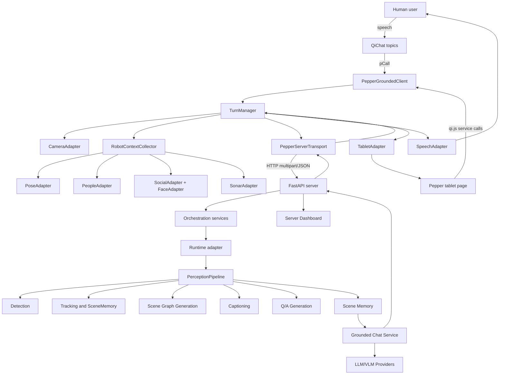

# System Description

This project implements a scene-aware dialogue system for the Pepper robot. Its purpose is to let Pepper converse about its current physical surroundings using images, robot-native perception signals, persistent scene memory, scene graphs, captions, and large language models.

The system is built around one central idea: a social robot should not only speak fluently; it should speak from an explicit and inspectable model of what it currently sees. Pepper can already speak, listen, move its head, show content on its tablet, and report people through NAOqi services, but those raw capabilities are not enough for grounded dialogue. The robot needs a richer semantic representation of the scene: objects, persistent identities, attributes, spatial relationships, people metadata, recent captions, and conversation history. This project builds that representation and exposes it to dialogue.

## What The Project Is Trying To Achieve

The project targets natural interaction with Pepper about the visible environment. A user should be able to ask questions such as:

- What do you see?
- Scan the room.
- What do you know about the chair?
- How many people do you see?
- Where is the laptop?
- Show me your memory.
- What questions can I ask?

The robot should answer using the current visual state rather than generic world knowledge. If the system has seen a person, a cat, a chair, a table, or a laptop, the response should be based on the stored scene memory. If Pepper's own people perception reports that someone is waving, sitting, looking at the robot, or standing at a certain distance, the server should use that signal when possible.

The project is therefore broader than a captioning demo. It is a full client-server system for:

- Capturing images on Pepper.
- Collecting Pepper robot metadata.
- Sending image and metadata payloads to a GPU-capable server.
- Running configurable detection, tracking, captioning, scene graph generation, and Q/A generation.
- Maintaining persistent scene memory across frames and scans.
- Using scene memory as grounding context for chat.
- Rendering memory and suggested questions on Pepper's tablet.
- Exposing a dashboard for development, monitoring, and runtime configuration.
- Supporting research and evaluation of scene graph quality and grounded dialogue behavior.

## Why The System Is Split Into Client And Server

Pepper is useful for embodied interaction but constrained as a modern AI runtime. The robot has cameras, microphones, speakers, a tablet, motion control, and NAOqi services, but it is not a suitable host for heavy vision-language inference, detector models, embedding models, or large language models.

The architecture therefore separates responsibilities:

- The robot client handles embodiment: speech, grammar, image capture, head movement, tablet display, and NAOqi metadata collection.
- The server handles intelligence-heavy work: detection, tracking, scene graph generation, memory, chat prompts, model providers, and the operator dashboard.
- An optional worker process isolates heavy GPU inference from the FastAPI web process.

This split is a practical requirement, not just a stylistic choice. It keeps Pepper responsive while allowing the server to run modern models and expose detailed debugging/monitoring tools.

## High-Level Architecture



## Runtime Domains

The system has three main runtime domains.

### Pepper Robot Client

The client lives under `client/` and is documented in [`robot-client/index.md`](robot-client/index.md).

Its main service is `PepperGroundedClient`, a NAOqi Python service. It exposes methods called by QiChat grammar and tablet JavaScript, such as:

- `look(lang_code)`
- `scan(lang_code)`
- `ask(lang_code, query)`
- `askAboutObject(lang_code, object_label)`
- `answerCachedQuestion(lang_code, question)`
- `showMemory(lang_code)`
- `resetMemory(lang_code)`
- `resetConversation()`

The client is deliberately lightweight. It does not run the detector, scene graph model, caption model, or LLM. It collects data and orchestrates interaction.

### FastAPI Server

The server lives under `server/` and is documented in [`server/index.md`](server/index.md).

It exposes public APIs for:

- Detection.
- Panorama detection.
- Captioning.
- General and object-focused chat.
- Vision chat.
- Memory summary and memory reset.
- Pregenerated Q/A pool access.
- Configuration and runtime control.
- Dashboard pages and WebSocket updates.

It owns the primary application state, configuration, model providers, scene memory, dashboard, and orchestration services.

### Optional Worker Runtime

The server can run heavy inference in a separate worker process. This helps isolate GPU memory use, model warmup, and failure/restart behavior from the main web server process.

The worker is useful when the server needs to keep HTTP orchestration responsive while detector, caption, scene graph, and embedding models are loaded in a child runtime.

## End-To-End User Interaction Flow

A typical interaction proceeds as follows.

1. The user speaks to Pepper.
2. QiChat grammar recognizes an intent.
3. QiChat calls a bound `PepperGroundedClient` method.
4. `PepperGroundedClient` delegates long-running work to `TurnManager`.
5. `TurnManager` captures one or more images if needed.
6. The client snapshots robot context: head pose, body yaw, camera FOV, visible people, social cues, face matches, and sonar.
7. `MetadataBuilder` builds a `RobotMetadata` JSON payload.
8. `PepperServerTransport` sends image bytes and metadata to the server.
9. The server runs the relevant pipeline or chat service.
10. The server updates scene memory and returns a response.
11. The client updates local state and dynamic concepts.
12. Pepper speaks the answer or shows memory on its local tablet page.

This design keeps the robot interaction loop simple while allowing the server to maintain a richer world model.

## Main User-Facing Interaction Modes

### Quick Look

A quick look captures one frame and asks the server for a caption. Depending on configuration, it can also update detection and scene memory.

Typical triggers:

- “What do you see?”
- “Look around.”
- “Koukni.”

Purpose:

- Fast scene description.
- Low-friction visual refresh.
- Useful when the user wants an immediate answer rather than a full scan.

### Full Scan

A scan moves Pepper's head through configured yaw angles and captures multiple images. The client can send those frames as a panorama request or as sequential detect requests.

Typical triggers:

- “Scan the room.”
- “Do a full scan.”
- “Oskenuj místnost.”

Purpose:

- Build broader scene memory than a single camera frame.
- Collect multiple views with metadata.
- Update memory before open-ended dialogue.

### General Scene-Aware Chat

General chat sends a user question to the server with conversation context and the current rendered scene memory.

Typical triggers:

- “How many people do you see?”
- “Where is the laptop?”
- “Describe the situation.”

Purpose:

- Answer flexible questions about the current scene.
- Use structured memory and recent captions as grounding.
- Continue conversation through a stored `chat_id`.

### Object-Focused Chat

Object chat is triggered when QiChat recognizes an object label from dynamic memory concepts. The server focuses the prompt on instances of that object, their attributes, relationships, counts, and optional crop fallback descriptions.

Typical triggers:

- “Tell me about the chair.”
- “What do you know about the person?”
- “Řekni mi něco o notebooku.”

Purpose:

- Narrow dialogue to one object type.
- Avoid dumping the whole scene when the user asks about one object.
- Use object-specific structured evidence.

### Memory Display

Memory display opens Pepper's local tablet page and shows:

- Detected object labels and counts.
- Detected attributes.
- Detected relationships.
- Server-rendered scene graph SVG.
- Pregenerated Q/A buttons.

Typical triggers:

- “Show me your memory.”
- “Show the scene graph.”
- “Ukaž paměť.”

Purpose:

- Give users and developers an inspectable view of what Pepper currently remembers.
- Make suggested questions visible.
- Allow tapping Q/A buttons on the tablet to make Pepper speak cached answers.

### Memory And Conversation Reset

The robot can reset visual memory, conversation history, or both.

Purpose:

- Start a clean interaction.
- Remove stale scene state.
- Avoid grounding future answers in old observations.

## Server-Side Perception Pipeline

The server perception pipeline is the central mechanism that turns images into scene memory.

At a high level, it can run these stages:

1. Captioning.
2. Object detection.
3. Tracking and memory association.
4. Pepper people/social metadata fusion.
5. Set-of-Mark image rendering.
6. Scene graph generation.
7. Q/A generation.
8. Caption-memory update.
9. Scene-graph-memory update.

The exact stages are controlled by runtime configuration. This matters because the system needs different speed/quality tradeoffs in different scenarios.

## Detection

The server supports configurable detection backends. The detector provides object labels, confidence scores, and bounding boxes.

Detection is the entry point into most scene-aware behavior. If objects are not detected, tracking, scene graphs, and grounded dialogue all become weaker.

The system also supports post-processing controls such as thresholds and optional NMS. These are exposed through server configuration and dashboard controls.

## Tracking And Scene Memory

Frame-level detections are not enough for dialogue. A robot conversation often contains follow-up references, and the robot needs to preserve object continuity across frames.

The server therefore maintains scene memory. Scene memory stores tracked objects, object IDs, labels, attributes, relationships, timestamps, frame IDs, scan IDs, social metadata, and object crops.

Tracking combines visual appearance and geometry to associate new detections with existing tracked objects. This lets the robot keep talking about “the same chair” or “the same person” after multiple frames.

Scene memory is also what allows the robot to answer after scanning. The answer does not have to be based only on the latest frame; it can be grounded in the current remembered state.

## Pepper Metadata Fusion

One important part of this project is combining server-side vision with Pepper-native perception.

Pepper can report people through `ALPeoplePerception`, including:

- Person IDs.
- Yaw and pitch angles.
- Distance.

Pepper can also provide social/person attributes through NAOqi modules, such as:

- Looking at the robot.
- Engagement zone.
- Sitting.
- Waving.
- Age estimates.
- Gender estimates.
- Smile score.
- Expression scores.
- Face labels.
- Sonar readings.

The server can match Pepper-reported people to detected visual people using camera geometry, FOV, angles, tracker stability, and previous bindings. When Pepper reports a person but the detector misses the person, the server can synthesize a person-like detection so that memory still contains the socially relevant human.

This is important for social robotics because the person near the robot is often more important to the dialogue than a generic object in the scene.

## Scene Graph Generation

Scene graphs represent objects, attributes, and relationships explicitly. A graph edge has the form:

```text
subject -- relation --> object
```

Unary attributes are represented as self-edges:

```text
object -- attribute --> object
```

The server supports multiple scene graph sources:

- Rule-based geometry and label rules.
- VLM-based scene graph generation using prompts and marked objects.
- Optional learned relation prediction through RelTR.
- Hybrid merging of multiple graph sources.

The purpose of the scene graph is not only to support models. It is also an inspectable intermediate representation. Developers can view it, debug it, render it, and use it to explain what the system believes.

## Set-of-Mark Grounding

The server can draw Set-of-Mark overlays on images. These overlays label detected objects with visible IDs. VLM prompts can then refer to those IDs explicitly.

This reduces ambiguity. Instead of asking a VLM to describe a free-form image, the system can ask for relationships among labeled objects only. That makes it easier to filter hallucinated edges and connect generated relations back to tracked objects.

## Captioning

Captioning provides quick natural-language scene summaries. Captions are useful in two ways:

- They support fast user-facing “what do you see?” behavior.
- They become additional grounding context for chat and scene graph prompts.

The system treats captions as auxiliary context, not as the whole world model. Captions are useful but too unstructured to replace scene memory and scene graphs.

## Q/A Generation

The server can generate concise question-answer pairs from current scene graph facts. These pairs are stored in a Q/A pool and exposed to the robot client through memory summary or the pregenerate-QA endpoint.

The robot uses these Q/A pairs in two ways:

- It inserts questions into the `memory_cached_questions` dynamic concept so the user can speak one of the suggested questions.
- It renders Q/A buttons on the tablet so the user can tap a question and make Pepper speak the cached answer.

This reduces latency for common grounded questions because the answer is already prepared.

## Grounded Dialogue

The dialogue layer uses LLMs, but the LLM is not treated as an unrestricted oracle. The server builds prompts from explicit scene state:

- Current objects.
- Object counts.
- Attributes.
- Relationships.
- Recent captions.
- Conversation history.
- Object-specific evidence for object chat.

This is a lightweight structured-grounding approach. It is related to Retrieval-Augmented Generation conceptually, but it is not a full document-vector RAG system. The “retrieved” context is the current structured scene memory rather than external documents.

This distinction matters. The system is built for situated robot dialogue, where the most important context is what Pepper sees and remembers now.

## Multilingual Behavior

The project supports English and Czech interaction paths.

On the robot side:

- English QiChat topic uses `enu`.
- Czech QiChat topic uses `czc`.
- Runtime language codes are normalized to `en` or `cs`.
- Server output language values are normalized to `english` or `czech`.

On the server side:

- Chat requests can specify output language.
- The dashboard can configure system output language.
- Translation services can detect and translate between English and Czech when needed.
- Conversation state stores language-related metadata.

This lets the administrator decide whether to operate models directly in the user language or translate through a canonical model-facing language.

## Dashboard And Operator Control

The server dashboard is an engineering and operator surface. It is used to inspect and tune the running system.

It supports:

- Live detection view.
- Scene graph inspection.
- Memory inspection.
- Conversation inspection.
- Q/A pool inspection and editing.
- Runtime configuration editing.
- Model/provider configuration.
- Worker controls.
- Pipeline stage controls.

The dashboard is not the same as Pepper's tablet UI. Pepper's tablet UI is local and minimal: it displays memory, graph SVG, object labels, attributes, relationships, and suggested Q/A. The server dashboard is for the developer/operator.

## Research And Evaluation Role

The repository also contains research tooling for evaluating and developing scene graph behavior.

The thesis framing treats evaluation as multi-level:

- Perception quality affects whether the scene model is correct.
- Tracking quality affects whether references remain stable.
- Scene graph quality affects whether relationships and attributes are useful for dialogue.
- Dialogue quality affects whether users receive grounded, helpful answers.
- Latency affects whether the robot feels responsive.

The research pipeline can reuse production components for detection, captioning, LLMs, VLMs, prompt rendering, vocabulary mining, scene graph generation, and graph metrics. This is intentional: offline experiments should evaluate components that are close to the deployed system.

## Intended Use

The system is intended for research and experimental deployment with Pepper, not as a polished consumer product.

Typical intended workflow:

1. Start the server with the desired config.
2. Confirm models/providers and worker mode in the dashboard.
3. Deploy or run the Pepper client.
4. Configure the robot client server URL.
5. Use QiChat to trigger quick look, full scan, object chat, general chat, memory display, and reset flows.
6. Monitor the server dashboard during experiments.
7. Inspect scene memory, scene graphs, and Q/A pool when debugging.
8. Adjust detection, scene graph, chat, caption, and pipeline settings through config/dashboard.
9. Use research scripts for offline evaluation when testing prompts, vocabularies, or graph-generation strategies.

## What The System Is Not

The project is intentionally scoped. It is not currently:

- A full autonomous navigation system.
- A manipulation system.
- A long-term personal memory system.
- A general-purpose agent planner.
- A fully onboard Pepper AI stack.
- A guarantee of perfect visual truth.
- A replacement for careful HRI evaluation.

It is a scene-aware dialogue and perception-grounding system. It provides the infrastructure for Pepper to talk about its surroundings with much stronger grounding than a generic chatbot or isolated image captioner.

## Main Design Principles

### Keep Robot And Server Responsibilities Separate

Pepper should handle embodiment and local signals. The server should handle heavy perception and language inference.

### Keep State Explicit

Scene memory, tracked objects, graph edges, captions, and Q/A pairs are explicit. This makes the system inspectable and debuggable.

### Prefer Configurable Components

The system supports multiple providers, backends, prompts, thresholds, graph-generation setups, and pipeline stages because research iteration requires fast changes.

### Support Fast And Slow Paths

A quick look should be fast. A full scan or richer graph generation can take longer. The architecture supports both interaction styles.

### Use Hybrid Reasoning

Geometry rules, detectors, trackers, robot-native metadata, VLMs, LLMs, and scene graphs are combined rather than forcing one model to do everything.

### Preserve Grounding Over Fluency

The system should prefer answers supported by scene memory. A fluent but ungrounded robot answer is worse than a concise answer that reflects what the robot actually knows.

## Where To Read Next

For implementation details, use these docs:

- [`server/index.md`](server/index.md) for the server architecture and file-by-file server docs.
- [`robot-client/index.md`](robot-client/index.md) for the robot client architecture and file-by-file client docs.
- [`server/api-reference.md`](server/api-reference.md) for HTTP routes and contracts.
- [`server/inference-pipeline.md`](server/inference-pipeline.md) for the perception pipeline.
- [`server/scene-memory-and-state.md`](server/scene-memory-and-state.md) for persistent scene memory.
- [`server/orchestration-and-conversations.md`](server/orchestration-and-conversations.md) for chat and Q/A behavior.
- [`robot-client/runtime-service-and-turns.md`](robot-client/runtime-service-and-turns.md) for Pepper-side action flows.
- [`robot-client/perception-and-metadata.md`](robot-client/perception-and-metadata.md) for robot metadata payloads.
- [`robot-client/tablet-memory-ui.md`](robot-client/tablet-memory-ui.md) for Pepper tablet memory display.
